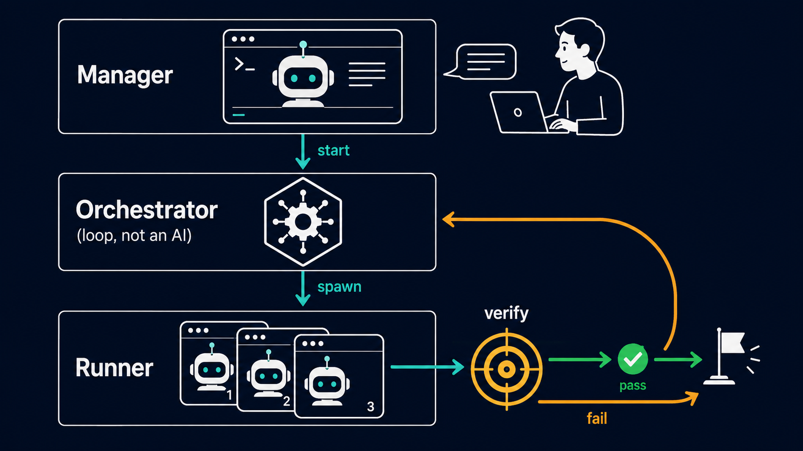

<p align="center">
  
</p>

<h1 align="center">GoaLoop</h1>

> A goal-driven multi-attempt iteration framework — a Ralph loop over
> `claude -p`, with just enough structure to be safe.

GoaLoop turns "iterate until the target is met" into a small, sharp
protocol on top of Claude Code. You write a `goal.md` that spells out
what "done" looks like and how to verify it. A small background
orchestrator then runs each attempt as a fresh **`claude -p` Runner** —
read context, verify, advance by one unit if needed, record — until the
verification passes or you stop it.

The framework is a lean Python package (`goaloop`: a `claude -p` adapter,
the attempt loop, and a `run`/`status`/`stop`/`continue` CLI) plus the
Claude Code skills and the Runner's system prompt. The orchestrator is
detached, so it keeps iterating even if you close the Claude Code session
that started it. On a Claude Code subscription, `claude -p` is
subscription-covered — no per-token API rates.

## Why

Many software engineering tasks share the same shape — define a
target, iterate, verify, repeat:

- Performance optimization
- Flaky test reduction
- Build-time optimization
- ML hyperparameter or model tuning
- Writing iteration (until a rubric passes)
- Cost optimization
- Security hardening

Existing tools for this pattern tend to bake in domain assumptions like
"artifact = GitHub PR" and "isolation = git worktree". GoaLoop makes no
domain assumptions — your `goal.md` and its verification scripts carry
all the domain knowledge.

See [`docs/design.md`](docs/design.md) for the full design and
rationale.

## Architecture in one picture

<p align="center">
  
</p>

Three layers: a **Manager** — the Claude Code agent you operate — starts
the **Orchestrator** (a detached loop, not an LLM), which spawns a fresh
**Runner** agent (`claude -p`) for each attempt. Every Runner verifies the
current state — on `pass` the loop exits; on `fail` it advances one unit
and the Orchestrator spawns the next Runner. The loop repeats until the
verification passes.

## Install

Two pieces, two commands: install the `goaloop` CLI (the orchestrator),
then deploy the Claude Code skills (the Manager front-end). Both ship in
the package — no source checkout needed.

```bash
uv tool install goaloop      # provides the `goaloop` command (stdlib-only, Python ≥ 3.10)
goaloop install              # deploys /goal-init, /goal-run, /goal-flash + the goal-runner agent into ~/.claude
```

`uvx goaloop ...` works too if you prefer not to install persistently;
`pip install goaloop` is equivalent if you don't use uv. The Runner's
system prompt ships inside the package (override with
`GOALOOP_RUNNER_PROMPT`). The CLI shells out to `claude`, so the Claude
Code CLI must be on your `PATH` and authenticated.

`goaloop install` skips any skill/agent that already exists; pass
`--force` to overwrite. Verify by opening Claude Code and typing
`/goal-init` — it should be recognized. (You can also drive the
orchestrator entirely from the shell with `goaloop run`, skipping the
skills.)

<details>
<summary>From source (development)</summary>

```bash
git clone https://github.com/luohaha/GoaLoop ~/GoaLoop
uv pip install -e ~/GoaLoop      # or: pip install -e ~/GoaLoop
goaloop install                  # same skill/agent deploy as above
# run without installing:  python3 -m goaloop ...  (from ~/GoaLoop)
```
</details>

## Quickstart

```
> /goal-init
```

Claude interviews you with seven questions: workspace name (the
workspace lives at `~/.goaloop/<name>`), objective, hard constraints,
how to verify the objective (concretely!), how to verify each
constraint, what environment/tools the verification needs, and any
initial context.

The interview is **strict** about getting concrete verification — if
you can't articulate a real check, GoaLoop refuses to write the
`goal.md`. That refusal is the point: a goal you can't verify is a
goal you can't reach.

When the interview completes, your workspace looks like:

```
<workspace>/
├── goal.md           # the spec — edit it mid-run if you want
├── memory/           # Runner-curated knowledge accumulates here
└── attempts/         # one file per attempt, write-once audit trail
```

Then start it (either way):

```
> /goal-run                  # via Claude Code: starts the orchestrator, relays status
$ goaloop run <name>         # or straight from the shell
```

### Fast path: `/goal-flash`

When the task is already clear enough to state in a sentence, the
seven-question interview is overkill. `/goal-flash <one-line task>`
infers a complete `goal.md` in one shot (workspace name, constraints,
environment — all derived; no question-at-a-time), shows it to you, and
starts the orchestrator immediately. The same hard rule still applies:
if a concrete verification can't be inferred, it refuses and sends you
to `/goal-init` rather than fabricating one. Since the goal was inferred,
`goal.md` stays the steering wheel — edit it mid-run if the inference was
off, or `goaloop stop`.

## Running

GoaLoop runs as a single self-driven loop — the `goaloop run`
orchestrator (a deterministic process, not an LLM). It is not wrapped in
`/loop`: in the default `auto` mode it paces itself between attempts
(`--interval`, default 30s), runs each attempt as a fresh `claude -p`
Runner, and exits on `pass`. Because it's a detached process, it keeps
going even if you close Claude Code.

```
> /goal-run                  # start + watch from Claude Code
$ goaloop status <name>      # check on it from the shell
$ tail -f ~/.goaloop/<name>/.goaloop/orchestrator.log   # watch live
$ goaloop continue <name>    # release the next attempt (copilot mode)
$ goaloop stop <name>        # stop early
```

The orchestrator terminates when:

- The Runner reports `pass` — goal met; the process exits.
- The Runner reports `blocked` — it judges the goal unreachable without a
  human; the process exits and `/goal-run` quotes the reason.
- It gives up with `error` after bounded retries of malformed / failing
  attempts (a broken-Runner guard, not a goal condition).
- You run `goaloop stop <name>` (SIGTERM).

(An API `quota` limit is not a stop — the orchestrator sleeps and resumes
the same session indefinitely.)

You stay in control throughout: read what each attempt did via
`/goal-run` or `goaloop status`; **edit `goal.md`** for a permanent
change or **append to `suggestions.md`** for a transient per-attempt
note — the next attempt picks it up. There's no live conversation into a
running Runner.

### Configuration & modes

An optional `<workspace>/config.yaml` sets defaults with flat keys —
`model` (model id for `claude -p`), `interval` (seconds between attempts,
default 30), and `mode` (`auto` default, or `copilot`). CLI flags
(`--model`, `--interval`, `--mode`) override `config.yaml`, which
overrides the built-in defaults.

In **copilot mode** the orchestrator pauses after each `advanced` attempt
and waits for your approval before the next one; release it with
`goaloop continue <name>`. (`pass`/`blocked`/`error` are terminal, and
`in_progress` resumes automatically — only `advanced` waits.)

`suggestions.md` is an optional async channel: append a one-off note and
the next fresh attempt sees the text added since it was last read, once.
Use `goal.md` for permanent/structural changes, `suggestions.md` for
transient nudges (e.g. left while AFK).

## Workspace contents

After running, the workspace looks like:

```
<workspace>/
├── goal.md
├── config.yaml           # optional: model / interval / mode
├── suggestions.md        # optional: async per-attempt notes
├── memory/
│   └── learnings.md      # ~4KB cap; Runner curates this
└── attempts/
    ├── 001.md            # one Markdown file per attempt
    ├── 002.md
    └── ...
```

- **`goal.md`** is the authoritative spec. Edit it mid-run to change
  the target or constraints — the next attempt picks it up.
- **`memory/learnings.md`** is the Runner's "textbook" — validated
  approaches, ruled-out hypotheses, surprising observations.
- **`attempts/NNN.md`** is the audit trail. Each Runner writes one
  and never modifies others. ~30 lines each.

## Design highlights

- **Verification is load-bearing.** The `goal.md` Verification section
  is a literal command/procedure, written by you at init time. The
  Runner executes it; never makes up a judgment.
- **Two-state verification, four terminators.** Verification itself is
  `pass` / `fail`, but each Runner ends with one of four statuses — `pass`
  (done), `advanced` (did one unit of work, go again), `in_progress`
  (paused to wait out a long pollable job, resume the same session), or
  `blocked` (stuck, needs a human). Long-running checks are completed
  inside one attempt rather than split across attempts.
- **Anti-cheat by time.** Each Runner is a fresh `claude -p` session.
  The Runner in attempt N judges what attempt N−1 left behind, with no
  shared context. Even for LLM-as-judge verification, no nested agent is
  needed — the time separation gives you arm's-length judging.
- **Honest about what the framework can enforce.** No budget caps and no
  forced attempt limits in `goal.md` — GoaLoop can read each attempt's
  reported cost but won't pretend to cap it mid-stream. The terminal states
  are `pass` (goal met), `blocked` (Runner judges it needs a human),
  `error` (the orchestrator gives up after bounded retries), and human
  `goaloop stop`.

## When NOT to use GoaLoop

- When you can't articulate a concrete verification procedure. If
  "what success looks like" is purely a human judgment call, the
  framework's load-bearing assumption breaks. Use direct conversation
  with Claude instead.
- When the iteration unit is sub-second. Spawning a `claude -p` Runner
  per attempt has a multi-second floor.
- When you need parallel exploration across independent hypotheses.
  Each orchestrator runs one Runner at a time. You can run multiple workspaces
  in parallel (`goaloop run` each), but there's no built-in coordination
  between them.

## Comparison to other tools

The closest sibling is Codex's built-in `goal` feature, which solves the
same "keep working toward a target across many turns" problem with nearly
opposite choices: an **in-process, continuation-based** loop with
self-audited completion, versus GoaLoop's **out-of-process, fresh-attempt**
loop with an externally verified gate. In short — Codex makes the agent its
own tireless project manager; GoaLoop makes the system an impartial referee
over disposable workers, with verification as a load-bearing, executable
gate rather than a self-report.

See [`docs/comparison-codex.md`](docs/comparison-codex.md) for the full
side-by-side — architecture, data model, and an in-depth look at where the
verification mechanisms diverge.

Claude Code's own built-in `/goal` command is the closest in-host sibling:
an in-process loop gated by a fresh small model that judges your condition
from the **conversation transcript** (it can't run commands itself), versus
GoaLoop's out-of-process loop gated by a fresh process that **re-runs the
check against real workspace state**. On the verification-independence axis
Claude `/goal` sits between Codex's self-audit and GoaLoop's executable
gate. See [`docs/comparison-claude-goal.md`](docs/comparison-claude-goal.md)
for the full side-by-side.

The closest competitor on verification independence is the
[pi](https://github.com/earendil-works/pi) agent's `pi-goal-x` extension:
it spawns an **independent auditor** (a separate agent with read-only tools)
that inspects the real workspace — but only **once, when the agent claims
completion**, and as a semantic LLM verdict. GoaLoop makes the same kind of
independent verification the **entrance gate of every attempt**, with a
deterministic, mandatory check and a disposable executor. See
[`docs/comparison-pi-goal.md`](docs/comparison-pi-goal.md) for the full
side-by-side (and a note on the several pi goal extensions).

## Status

v0.1. The `goaloop` loop, CLI, and skills are implemented and pass an
end-to-end smoke test; not yet battle-tested across diverse domains. The
design and rationale are in [`docs/design.md`](docs/design.md).

## License

Apache License 2.0. See [LICENSE](LICENSE).
