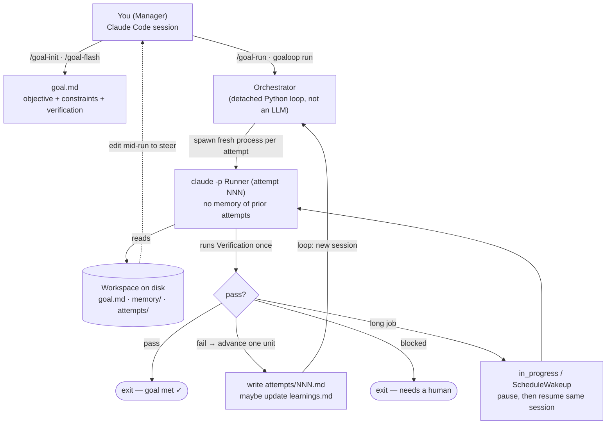
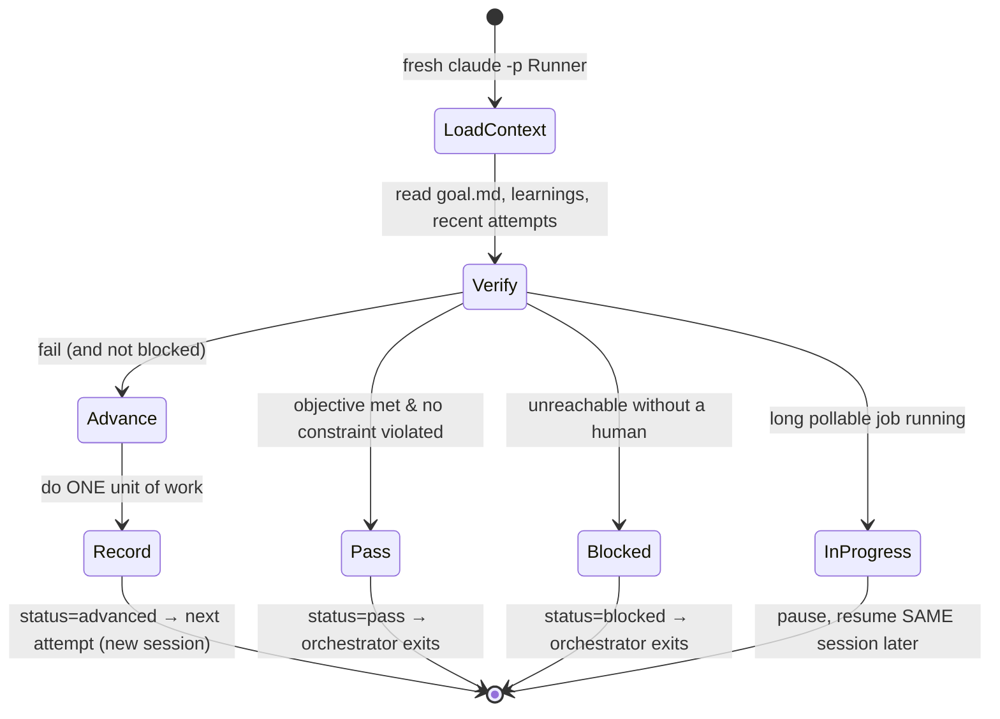

# GoaLoop — image generation prompts

Prompts for generating the project's visual assets with **nano banana**
(Gemini 2.5 Flash Image). Edit freely — each block is self-contained and
copy-pasteable. Keep generated files under `docs/assets/` and reference
them from the README.

> **Read this first — what nano banana is good and bad at.**
> It's excellent at logos, icons, and stylized illustration. It is
> *unreliable at rendering precise text inside boxes* — architecture and
> flow diagrams with many labels often come out misspelled or misaligned.
> For those, treat the prompts below as "concept art" and verify every
> word, **or** use the Mermaid versions at the bottom (GitHub renders
> Mermaid natively, text is always correct, and it's trivially editable).

---

## Shared visual identity (the "design tokens")

Keep these consistent across every asset so the set looks like one brand.

- **Concept:** *Goal + Loop.* A cyclic path that converges on a target —
  each pass tightening toward the center. Disposable attempts, one bullseye.
- **Core motif:** a looping arrow / spiral that wraps around concentric
  target rings and lands on the center with a small check mark.
- **Palette:**
  - Background / ink: midnight navy `#0E1726`
  - Primary loop: electric teal `#2DD4BF`
  - Goal / target core: warm amber `#F5A524`
  - Verified accent (the "pass" hit): signal green `#22C55E`
  - Light surface (for light-mode assets): off-white `#F7F8FA`
- **Style:** modern flat vector, geometric, clean line work, subtle depth,
  no gradients heavier than a soft duotone, no skeuomorphism, no clutter.
- **Feel:** technical and precise but warm — a developer tool with taste.
  Think "well-designed CLI", not "enterprise SaaS".

---

## 1. Logo — icon mark (primary)

Use as the repo avatar / favicon / header badge. Square, works small.

```
A minimalist flat-vector logo icon for a developer tool called "GoaLoop".
Concept: a single continuous looping arrow that spirals inward and wraps
around three concentric target rings (a bullseye), ending at the center
with a small precise check mark. The loop suggests iteration; the bullseye
suggests a goal; the check mark suggests verified success.

Style: modern geometric flat design, clean confident line work of even
weight, minimal, balanced negative space, slight sense of motion in the
spiral. Subtle duotone shading only.

Colors: deep midnight navy background (#0E1726), the looping arrow in
electric teal (#2DD4BF), the target core in warm amber (#F5A524), and the
center check mark in signal green (#22C55E).

Composition: centered, square 1:1, generous padding, designed to stay
legible at small sizes (favicon). No text, no letters, no words. Crisp
vector edges, app-icon quality.
```

**Variants to try** (swap into the prompt):
- *Transparent background* — add: "transparent background, no backdrop,
  icon only" (for overlaying on README).
- *Light mode* — swap background to off-white `#F7F8FA`, keep the teal/
  amber/green marks.
- *Monochrome* — "single-color teal `#2DD4BF` line icon on transparent
  background" (for a one-color stamp).

---

## 2. Logo — wordmark lockup (secondary)

Horizontal lockup for the top of the README. ⚠️ Text spelling is the #1
failure mode — generate several and pick the one that spells **GoaLoop**
correctly (capital G, capital L, lowercase rest), or generate the icon
only and set the text in real type afterward.

```
A horizontal logo lockup for a developer tool. On the left, a small flat-
vector icon: a looping arrow spiraling into a concentric-ring bullseye with
a tiny check mark at the center. To its right, the wordmark "GoaLoop" in a
clean modern geometric sans-serif, medium weight, the two capital O-like
letters subtly echoing the target rings.

Colors: wordmark in off-white (#F7F8FA), icon loop in electric teal
(#2DD4BF), target core in warm amber (#F5A524), on a deep midnight navy
background (#0E1726).

Style: minimal, balanced, generous spacing, premium developer-tool brand
feel. Wide aspect ratio about 4:1. Spelling must read exactly "GoaLoop".
```

---

## 3. Architecture — concept illustration

⚠️ Diagram-with-labels territory — nano banana will likely garble the
text. Best used as a *decorative hero image* with minimal/no words; for an
accurate labeled diagram use the Mermaid version in §6.

```
An isometric flat-vector illustration of a software pipeline, GoaLoop's
"goal-driven attempt loop". Three stacked layers connected by a glowing
teal loop arrow that cycles back on itself:
1) a person at a terminal (the human Manager),
2) a small gear / daemon box (the orchestrator, deterministic),
3) a series of identical fresh worker chips spawned one after another
   (each a disposable "claude -p" Runner), feeding into
4) a stack of document/file cards on the right (the workspace on disk:
   goal, memory, attempts), with a bullseye target glowing above the stack.

A teal loop arrow flows worker -> files -> back to a new worker, conveying
"fresh attempt each time". When the loop reaches the bullseye, a green
check mark lights up.

Style: clean isometric flat design, midnight navy background (#0E1726),
electric teal (#2DD4BF) flow lines, warm amber (#F5A524) target, signal
green (#22C55E) success accent, off-white (#F7F8FA) surfaces. Minimal,
uncluttered, no readable text labels (use shapes and icons, not words).
Wide 16:9 banner composition.
```

---

## 4. Flow — the attempt lifecycle (concept illustration)

⚠️ Same caveat. Decorative; for the precise version use Mermaid in §7.

```
A flat-vector cyclical flow illustration showing one iteration of a loop.
A circular arrangement of four nodes connected by a teal arrow that loops
clockwise: (1) a magnifying-glass node "verify", branching to (2) a green
check-mark node "pass / done", (3) a wrench node "advance one step" that
arcs back to the start, and (4) a pause/clock node "waiting". A bullseye
target sits at the center of the circle.

Style: minimal geometric flat design, midnight navy background (#0E1726),
electric teal (#2DD4BF) arrows, warm amber (#F5A524) center target, signal
green (#22C55E) for the success node. Icons over words; avoid text labels.
Square or 4:3 composition, balanced, clean.
```

---

## 5. nano banana usage tips

- **Aspect ratio:** state it in the prompt ("square 1:1", "wide 16:9",
  "4:1 lockup"). nano banana honors explicit ratios well.
- **Transparent background:** ask for "transparent background, no backdrop"
  — needed for logos placed over the README.
- **Iterate conversationally:** generate, then refine in follow-ups
  ("same icon, thinner lines", "more negative space", "remove the outer
  ring"). It edits its own output well.
- **Text is the weak spot:** for anything with words, generate 4–6 and
  cherry-pick, or generate text-free and add type yourself. Don't trust
  the first spelling.
- **Consistency:** paste the *Shared visual identity* hex codes into every
  prompt so the set coheres.

---

## 6. Architecture diagram — Mermaid (accurate, README-ready)

GitHub renders this natively; text is always correct; edit it in place.



---

## 7. Attempt lifecycle — Mermaid (accurate, README-ready)


